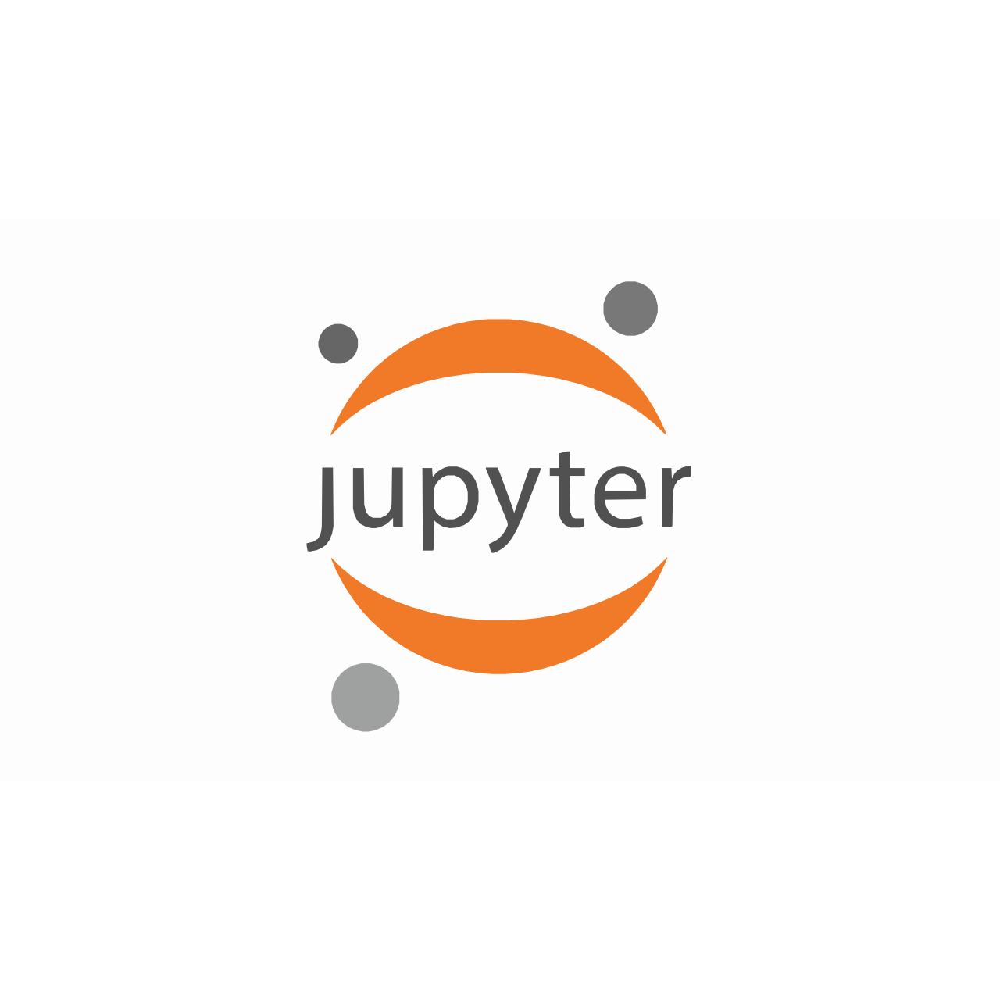

# 👨‍💻 Hi, I'm Conccurer!

**`Data Scientist`**

👋 Hey there! I'm Anirudh Prakash — a tech explorer, code artisan, and data detective on a journey to turn code into impactful solutions! 🚀

💻 My Toolbox: Armed with HTML, CSS, and Python, I enjoy solving problems, building engaging web applications, and diving deep into data analysis. I’m constantly honing my skills with courses like "Mathematics for Machine Learning" and "Python for Data Science" to stay on the cutting edge.

🎯 What I Love: Open-source projects, clean code, and algorithms that make you say, "Wow!" I’m all about bringing creativity to coding, transforming complex challenges into simple solutions, and contributing to the tech community.

✨ Let’s Build the Future Together: I value innovation, knowledge sharing, and the thrill of solving the unsolvable. Ready to collaborate? Let’s connect, create, and code our way to a brighter future!

---

### 🧰 Languages and Tools

 

#
# 📊 GitHub Stats:

## 🌐 Socials:
   

## 💻 Tech Stack:
             

---

